[TOC]

# 1. Introduction to Dataset

**From https://www.kaggle.com/mlg-ulb/creditcardfraud/home :** 

The datasets contains transactions made by credit cards in September 2013 by european cardholders. This dataset presents transactions that **occurred in two days**, where we have 492 frauds out of 284,807 transactions. The dataset is highly unbalanced, the positive class (frauds) account for ==0.172%== of all transactions.

**PCA Features:**

It contains only numerical input variables which are the result of a PCA transformation. Features V1, V2, ... V28 are the principal components obtained with PCA.

**Time:**

Feature 'Time' contains the seconds elapsed between each transaction and the first transaction in the dataset. 

**Amount:** 

The feature 'Amount' is the transaction Amount.

**Class:**

Feature 'Class' is the response variable and it takes value 1 in case of fraud and 0 otherwise.

## Preview of Data

<table border="1" class="dataframe">
  <thead>
    <tr style="text-align: right;">
      <th></th>
      <th>Time</th>
      <th>V1</th>
      <th>V2</th>
      <th>V3</th>
      <th>V4</th>
      <th>V5</th>
      <th>V6</th>
      <th>V7</th>
      <th>V8</th>
      <th>V9</th>
      <th>...</th>
      <th>V21</th>
      <th>V22</th>
      <th>V23</th>
      <th>V24</th>
      <th>V25</th>
      <th>V26</th>
      <th>V27</th>
      <th>V28</th>
      <th>Amount</th>
      <th>Class</th>
    </tr>
  </thead>
  <tbody>
    <tr>
      <th>0</th>
      <td>0.0</td>
      <td>-1.359807</td>
      <td>-0.072781</td>
      <td>2.536347</td>
      <td>1.378155</td>
      <td>-0.338321</td>
      <td>0.462388</td>
      <td>0.239599</td>
      <td>0.098698</td>
      <td>0.363787</td>
      <td>...</td>
      <td>-0.018307</td>
      <td>0.277838</td>
      <td>-0.110474</td>
      <td>0.066928</td>
      <td>0.128539</td>
      <td>-0.189115</td>
      <td>0.133558</td>
      <td>-0.021053</td>
      <td>149.62</td>
      <td>0</td>
    </tr>
    <tr>
      <th>1</th>
      <td>0.0</td>
      <td>1.191857</td>
      <td>0.266151</td>
      <td>0.166480</td>
      <td>0.448154</td>
      <td>0.060018</td>
      <td>-0.082361</td>
      <td>-0.078803</td>
      <td>0.085102</td>
      <td>-0.255425</td>
      <td>...</td>
      <td>-0.225775</td>
      <td>-0.638672</td>
      <td>0.101288</td>
      <td>-0.339846</td>
      <td>0.167170</td>
      <td>0.125895</td>
      <td>-0.008983</td>
      <td>0.014724</td>
      <td>2.69</td>
      <td>0</td>
    </tr>
    <tr>
      <th>2</th>
      <td>1.0</td>
      <td>-1.358354</td>
      <td>-1.340163</td>
      <td>1.773209</td>
      <td>0.379780</td>
      <td>-0.503198</td>
      <td>1.800499</td>
      <td>0.791461</td>
      <td>0.247676</td>
      <td>-1.514654</td>
      <td>...</td>
      <td>0.247998</td>
      <td>0.771679</td>
      <td>0.909412</td>
      <td>-0.689281</td>
      <td>-0.327642</td>
      <td>-0.139097</td>
      <td>-0.055353</td>
      <td>-0.059752</td>
      <td>378.66</td>
      <td>0</td>
    </tr>
    <tr>
      <th>3</th>
      <td>1.0</td>
      <td>-0.966272</td>
      <td>-0.185226</td>
      <td>1.792993</td>
      <td>-0.863291</td>
      <td>-0.010309</td>
      <td>1.247203</td>
      <td>0.237609</td>
      <td>0.377436</td>
      <td>-1.387024</td>
      <td>...</td>
      <td>-0.108300</td>
      <td>0.005274</td>
      <td>-0.190321</td>
      <td>-1.175575</td>
      <td>0.647376</td>
      <td>-0.221929</td>
      <td>0.062723</td>
      <td>0.061458</td>
      <td>123.50</td>
      <td>0</td>
    </tr>
    <tr>
      <th>4</th>
      <td>2.0</td>
      <td>-1.158233</td>
      <td>0.877737</td>
      <td>1.548718</td>
      <td>0.403034</td>
      <td>-0.407193</td>
      <td>0.095921</td>
      <td>0.592941</td>
      <td>-0.270533</td>
      <td>0.817739</td>
      <td>...</td>
      <td>-0.009431</td>
      <td>0.798278</td>
      <td>-0.137458</td>
      <td>0.141267</td>
      <td>-0.206010</td>
      <td>0.502292</td>
      <td>0.219422</td>
      <td>0.215153</td>
      <td>69.99</td>
      <td>0</td>
    </tr>
  </tbody>
</table>
<p>5 rows × 31 columns</p>
# 2. Exploratory Data Analysis

**Columns:**

    Index(['Time', 'V1', 'V2', 'V3', 'V4', 'V5', 'V6', 'V7', 'V8', 'V9', 'V10',
           'V11', 'V12', 'V13', 'V14', 'V15', 'V16', 'V17', 'V18', 'V19', 'V20',
           'V21', 'V22', 'V23', 'V24', 'V25', 'V26', 'V27', 'V28', 'Amount',
           'Class'],
          dtype='object')

**Data Shape:**


    (284807, 31)

## Checking for Missing Data.

- Fortunately, data integrity is perfect. All non-null, and no mixed types.

```
Data columns (total 31 columns):
Time      284807 non-null float64
V1        284807 non-null float64
V2        284807 non-null float64
V3        284807 non-null float64
V4        284807 non-null float64
V5        284807 non-null float64
V6        284807 non-null float64
V7        284807 non-null float64
V8        284807 non-null float64
V9        284807 non-null float64
V10       284807 non-null float64
V11       284807 non-null float64
V12       284807 non-null float64
V13       284807 non-null float64
V14       284807 non-null float64
V15       284807 non-null float64
V16       284807 non-null float64
V17       284807 non-null float64
V18       284807 non-null float64
V19       284807 non-null float64
V20       284807 non-null float64
V21       284807 non-null float64
V22       284807 non-null float64
V23       284807 non-null float64
V24       284807 non-null float64
V25       284807 non-null float64
V26       284807 non-null float64
V27       284807 non-null float64
V28       284807 non-null float64
Amount    284807 non-null float64
Class     284807 non-null int64
dtypes: float64(30), int64(1)
```

​    

## Class Imbalance

- This is the most unique quality about this dataset. Most of the steps taken later will be about multiple ways of dealing with imbalanced data.

    **Distribuition of Normal(0) and Frauds(1): **
    0    284315
    1       492

- Non-Frauds 99.83 % of the dataset
- Frauds 0.17 % of the dataset


## Visualizing distributions. 
- Features have different central tendencies and need to be normalized to make better sense of them.
- 'Time' is encoded in two days' worth of seconds. We'll need to transform it in order to visualize it properly.


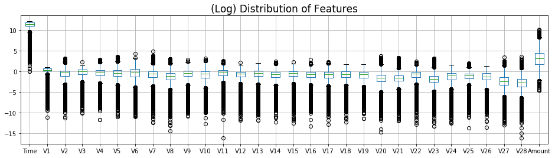


- It's clear that `Time` and `Amount` are in a different range compared to the `PCA` features.

## 'Amount' Distribution

- 'Amount' isn't normalized.
- There's high concentrations of small-amount transactions. And many dispersed large-amount outliers, all the way up to \$25,000
- 85% of data is below \$140
- Top 1% of transaction amounts are between $1,017.97 and \$25,691.16

- 80% of Frauds are less than: \$152.34.


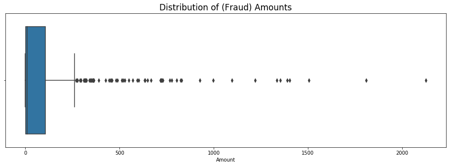

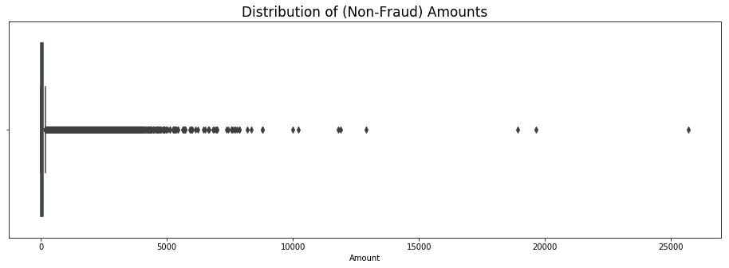


## 'Time' Distribution
- I'll convert 'Time' to hours and minutes, which will allow for better visualization.
- 'Time' distribution (by second) shows two normal curves, which might reveal something meaningful for predicting purposes. This will be the basis for a time-based feature engineering.

**Raw 'Time', by seconds:**


**Raw 'Time', colored by class:** (green is non-frauds, red is frauds)

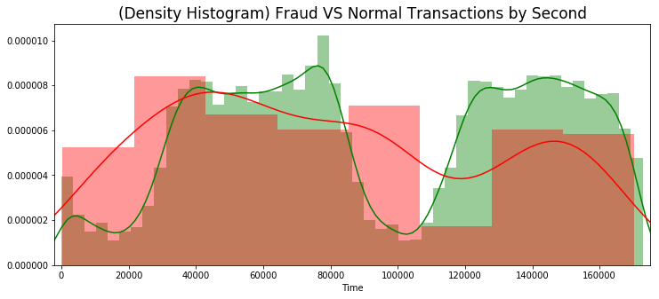

**(Transformed) 'Time' in hour units, colored by class:** (green is non-frauds, red is frauds)

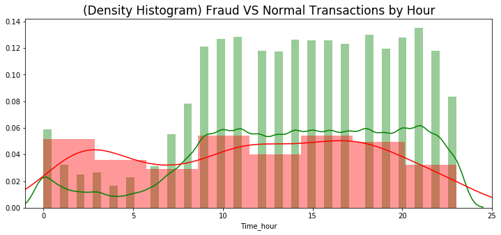

# 3. Modeling Outcome of Interest

## Feature Engineering

- Classification algorithms expect to receive normalized features. There are two features in the data that aren't normalized. ('Time' and 'Amount')

- New features could be created from those unprocessed features, if they capture a pattern correlated to 'Class'.

### Time-Based Features

- There seem to be two normal distributions in the feature Time. Let's isolate them so we can create features from them.


### Feature: Time_hour > 4

- Feature for non-frauds, where 'Time_hour' is above 4. This seems to have a clear differentiation.


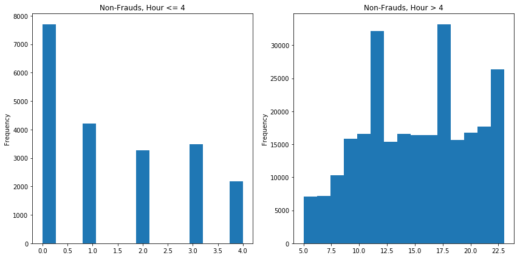


### Feature: \$0 Fraud Amounts...?

- Many transactions are zero dollars. This might be confusing for our model's predictive ability. It is arguable these don't need to be prevented. 

    - One approach could be to simply discard these transactions. 
    - The second approach is to ignore it and focus on predicting transactions labeled as 'frauds', regardless of them having no dollar-value.

    ```
    Non-Fraud Zero dollar Transactions:
    1798
    Fraudulent Zero dollar Transactions:
    27
    ```

    **For now, I'll keep them.**

    ### Normalize Time and Amount

-  Although we already captured some features from 'Time' and 'Amount', I'd like to normalize and test them in the model.

### Add the Rest: PCA and Class

**Preview of data after feature engineering:**

<table border="1" class="dataframe">
  <thead>
    <tr style="text-align: right;">
      <th></th>
      <th>100k_time</th>
      <th>4_hour</th>
      <th>amount0</th>
      <th>scaled_amount</th>
      <th>scaled_time</th>
      <th>V1</th>
      <th>V2</th>
      <th>V3</th>
      <th>V4</th>
      <th>V5</th>
      <th>...</th>
      <th>V20</th>
      <th>V21</th>
      <th>V22</th>
      <th>V23</th>
      <th>V24</th>
      <th>V25</th>
      <th>V26</th>
      <th>V27</th>
      <th>V28</th>
      <th>Class</th>
    </tr>
  </thead>
  <tbody>
    <tr>
      <th>0</th>
      <td>1</td>
      <td>0</td>
      <td>0</td>
      <td>1.783274</td>
      <td>-0.994983</td>
      <td>-1.359807</td>
      <td>-0.072781</td>
      <td>2.536347</td>
      <td>1.378155</td>
      <td>-0.338321</td>
      <td>...</td>
      <td>0.251412</td>
      <td>-0.018307</td>
      <td>0.277838</td>
      <td>-0.110474</td>
      <td>0.066928</td>
      <td>0.128539</td>
      <td>-0.189115</td>
      <td>0.133558</td>
      <td>-0.021053</td>
      <td>0</td>
    </tr>
    <tr>
      <th>1</th>
      <td>1</td>
      <td>0</td>
      <td>0</td>
      <td>-0.269825</td>
      <td>-0.994983</td>
      <td>1.191857</td>
      <td>0.266151</td>
      <td>0.166480</td>
      <td>0.448154</td>
      <td>0.060018</td>
      <td>...</td>
      <td>-0.069083</td>
      <td>-0.225775</td>
      <td>-0.638672</td>
      <td>0.101288</td>
      <td>-0.339846</td>
      <td>0.167170</td>
      <td>0.125895</td>
      <td>-0.008983</td>
      <td>0.014724</td>
      <td>0</td>
    </tr>
    <tr>
      <th>2</th>
      <td>1</td>
      <td>0</td>
      <td>0</td>
      <td>4.983721</td>
      <td>-0.994972</td>
      <td>-1.358354</td>
      <td>-1.340163</td>
      <td>1.773209</td>
      <td>0.379780</td>
      <td>-0.503198</td>
      <td>...</td>
      <td>0.524980</td>
      <td>0.247998</td>
      <td>0.771679</td>
      <td>0.909412</td>
      <td>-0.689281</td>
      <td>-0.327642</td>
      <td>-0.139097</td>
      <td>-0.055353</td>
      <td>-0.059752</td>
      <td>0</td>
    </tr>
    <tr>
      <th>3</th>
      <td>1</td>
      <td>0</td>
      <td>0</td>
      <td>1.418291</td>
      <td>-0.994972</td>
      <td>-0.966272</td>
      <td>-0.185226</td>
      <td>1.792993</td>
      <td>-0.863291</td>
      <td>-0.010309</td>
      <td>...</td>
      <td>-0.208038</td>
      <td>-0.108300</td>
      <td>0.005274</td>
      <td>-0.190321</td>
      <td>-1.175575</td>
      <td>0.647376</td>
      <td>-0.221929</td>
      <td>0.062723</td>
      <td>0.061458</td>
      <td>0</td>
    </tr>
    <tr>
      <th>4</th>
      <td>1</td>
      <td>0</td>
      <td>0</td>
      <td>0.670579</td>
      <td>-0.994960</td>
      <td>-1.158233</td>
      <td>0.877737</td>
      <td>1.548718</td>
      <td>0.403034</td>
      <td>-0.407193</td>
      <td>...</td>
      <td>0.408542</td>
      <td>-0.009431</td>
      <td>0.798278</td>
      <td>-0.137458</td>
      <td>0.141267</td>
      <td>-0.206010</td>
      <td>0.502292</td>
      <td>0.219422</td>
      <td>0.215153</td>
      <td>0</td>
    </tr>
  </tbody>
</table>
<p>5 rows × 34 columns</p>


## Data Processing (On the Training Data Only)

- Data processing will include class-balancing, removing outliers, and feature-selection.
- These steps will be taken only on the training data, so that we can evaluate the model on the unprocessed `test` data.

### Balancing Classes

**There's several methods for balancing classes:**

---
- Random-Undersampling of Majority Class.

You reduce the size of majority class to match size of minority class. Disadvantage is that you may end up with very little data.

---

- SMOTE- Synthetic Minority Oversampling Technique.

Algorithm that creates a larger sample of minority class to match the size of majority class.

---
- Inverting Class Ratios. (Turning minority into majority)

If you turn the minority into the majority, you may skew results towards better recall scores(detecting frauds correctly), as opposed to better specificity scores.(detecting non-frauds correctly)

---

**For now, I'll balance with a variant implementation of SMOTE, called ADASYN, to see correlations.**

    Data shape before balancing: (227845, 34)
    
    Counts of frauds VS non-frauds in previous data:
    0    227451
    1       394
    ----------------------------------------
    ----------------------------------------
    Data shape after balancing: (454905, 34)
    
    Counts of frauds VS non-frauds in new data:
    1    227454
    0    227451


- Now we have much more data because the frauds were oversampled to match the size of non-frauds.
- Notice that ADASYN isn't perfectly matching the number of frauds to the majority class. This is good enough though. 

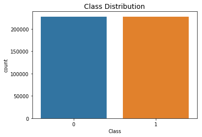

### Removing High-Correlation Outliers

- **This step must be taken after balancing classes.** Otherwise, correlations will echo class-distributions. To illustrate, I'll include two versions of the correlation matrix.
- Based on a correlation matrix, we'll identify features with high correlations, and remove any transactions with outlying values in these.
- High correlation features have a high capacity to influence the algorith prediction. Therefore it's important to control their anomalies.
- This approach will reduce prediction bias because our algorithm will learn from more normally-distributed features. 


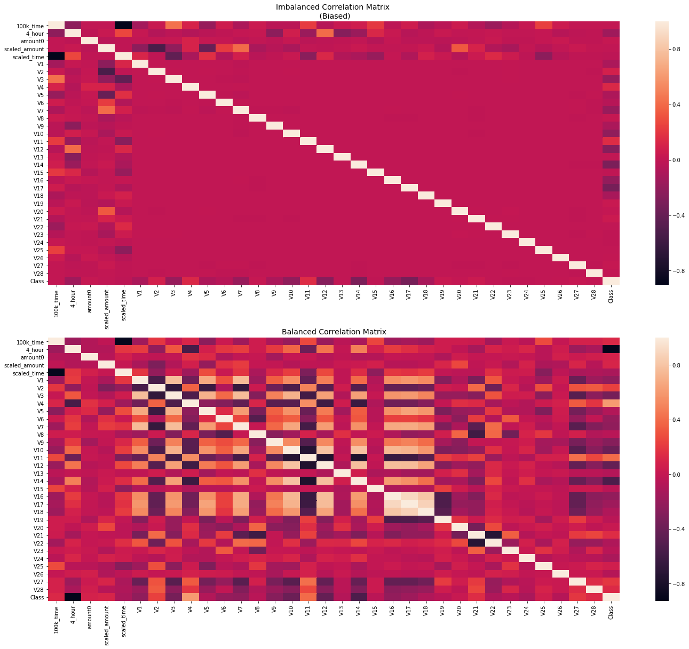


- From the feature engineered variables, it looks like `4_hour` has a very strong (negative) correlation with 'Class'. Well, at least one was useful.

---

#### Approach for Outlier Removal

**For features of high positive correlation...**
Remove non-fraud outliers on the top range, (improve recall) and remove fraud outliers on the bottom range. (improve specificity)

**For features of high negative correlation...**
Remove non-fraud outliers on the bottom range, (improve recall) and remove fraud outliers on the top range. (improve specificity)


    Counts of frauds VS non-frauds in previous data:
    1    227454
    0    227451
    ----------------------------------------
    Counts of frauds VS non-frauds in new data:
    0    225209
    1    220438


- Outliers from high-correlation features are now gone. However, this created a class-imbalance again. It'll be corrected later when we undersample both classes to reduce fitting times.


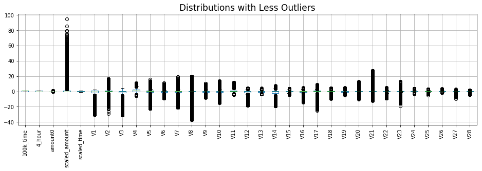

## Feature Selection

But first, let's see what the outlier removal did to the correlations.


- It's obvious that most features gained correlation power, regardless of direction. Positive correlations went higher up, negative correlations went lower down. Also, the highest correlations flattened out, while the smallest ones rose to relevance.
- It is an indicator that the outliers were causing noise, and therefore dimming the correlation-potential of each feature.


    Data shape before feature selection: (445647, 34)
    --------------------------------------------------
    Data shape after feature selection: (445647, 23)


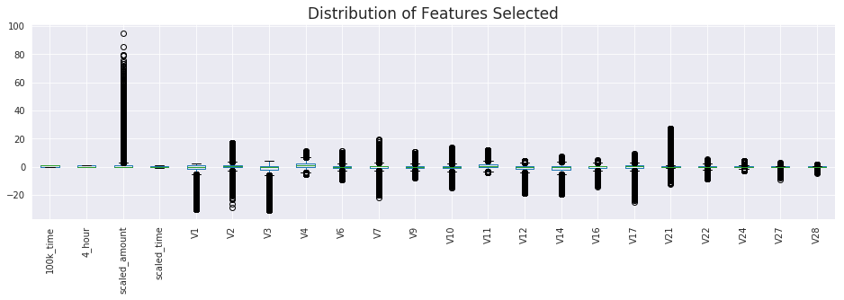

## Test and Compare Classifiers

**I'll reduce model size to 5,000 samples for each feature.**


    X_train shape after reduction: (10000, 22)
    
    Counts of frauds VS non-frauds in y_train:
    (array([0, 1]), array([5000, 5000]))

### First-Run: Predictions on Default Parameters

**These scores represent a baseline performance we'll build upon.**

- They are mildly good, considering we haven't tweaked parameters. That means our train data is doing well.

<table border="1" class="dataframe">
  <thead>
    <tr style="text-align: right;">
      <th></th>
      <th>Train_Recall</th>
      <th>Test_Recall</th>
      <th>Test_Specificity</th>
    </tr>
  </thead>
  <tbody>
    <tr>
      <th>SVC_default</th>
      <td>0.9998</td>
      <td>0.765306</td>
      <td>0.991119</td>
    </tr>
    <tr>
      <th>LogisticRegression_default</th>
      <td>0.9978</td>
      <td>0.989796</td>
      <td>0.976611</td>
    </tr>
    <tr>
      <th>DecisionTreeClassifier_default</th>
      <td>0.998</td>
      <td>0.989796</td>
      <td>0.993739</td>
    </tr>
    <tr>
      <th>KNeighborsClassifier_default</th>
      <td>0.9998</td>
      <td>0.908163</td>
      <td>0.96722</td>
    </tr>
  </tbody>
</table>
### Logistic Regression- GridSearch & Recall Score.

- `GridSearchCV` compares parameter combinations to find the highest score, determined by the user. I'll set `recall_score` to be the determinant factor for the best parameter combination.

- The `class_weight` parameter greatly skews the classification emphasis from focusing on frauds at the expense of more non-fraud errors. For now, I'll prioritize fraud prevention (Recall). Later, I'll attempt to improve on specificity.


     ---------------------------------------- 
     LogisticRegression 
     ----------------------------------------
    Best parameters: 
    
     {'C': 0.3, 'penalty': 'l2', 'solver': 'newton-cg'} 
    
    TRAIN GROUP
    
    Cross-validation recall scores: [1. 1. 1.]
    Mean recall score: 1.0
    
    TEST GROUP
    
    Recall: 1.0

**Confusion matrix between `y_test` data and predictions from`X_test` .**

The rows show the actual data, the colums show the predicted data.


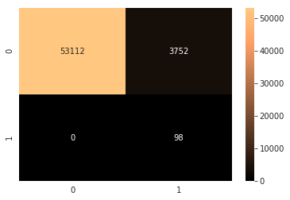


<table border="1" class="dataframe">
  <thead>
    <tr style="text-align: right;">
      <th></th>
      <th>Train_Recall</th>
      <th>Test_Recall</th>
      <th>Test_Specificity</th>
    </tr>
  </thead>
  <tbody>
    <tr>
      <th>SVC_default</th>
      <td>0.9998</td>
      <td>0.765306</td>
      <td>0.991119</td>
    </tr>
    <tr>
      <th>LogisticRegression_default</th>
      <td>0.9978</td>
      <td>0.989796</td>
      <td>0.976611</td>
    </tr>
    <tr>
      <th>DecisionTreeClassifier_default</th>
      <td>0.998</td>
      <td>0.989796</td>
      <td>0.993739</td>
    </tr>
    <tr>
      <th>KNeighborsClassifier_default</th>
      <td>0.9998</td>
      <td>0.908163</td>
      <td>0.96722</td>
    </tr>
    <tr>
      <th>LogisticRegression_search</th>
      <td>1</td>
      <td>1</td>
      <td>0.934018</td>
    </tr>
  </tbody>
</table>


### Pyrrhic Victory-

**A victory that inflicts such a devastating toll on the victor that it is tantamount to defeat. Someone who wins a Pyrrhic victory has also taken a heavy toll that negates any true sense of achievement.**

- Well, fraud recall improved on Logistic Regression.
- However, this has come at the cost of horribly low specificity.

- `GridSearch` allows us to see the results that informed the choice of best parameters, based on our scoring function. In this case, `recall_score`. Let's see how they compare.

<table border="1" class="dataframe">
  <thead>
    <tr style="text-align: right;">
      <th></th>
      <th>param_C</th>
      <th>param_penalty</th>
      <th>param_solver</th>
      <th>params</th>
      <th>split0_test_score</th>
      <th>split1_test_score</th>
      <th>split2_test_score</th>
      <th>mean_test_score</th>
      <th>std_test_score</th>
      <th>rank_test_score</th>
      <th>split0_train_score</th>
      <th>split1_train_score</th>
      <th>split2_train_score</th>
      <th>mean_train_score</th>
      <th>std_train_score</th>
    </tr>
  </thead>
  <tbody>
    <tr>
      <th>0</th>
      <td>0.3</td>
      <td>l2</td>
      <td>newton-cg</td>
      <td>{'C': 0.3, 'penalty': 'l2', 'solver': 'newton-...</td>
      <td>1.0</td>
      <td>1.0</td>
      <td>1.0</td>
      <td>1.0</td>
      <td>0.0</td>
      <td>1</td>
      <td>1.0</td>
      <td>1.0</td>
      <td>1.0</td>
      <td>1.0</td>
      <td>0.0</td>
    </tr>
    <tr>
      <th>25</th>
      <td>1</td>
      <td>l1</td>
      <td>saga</td>
      <td>{'C': 1, 'penalty': 'l1', 'solver': 'saga'}</td>
      <td>1.0</td>
      <td>1.0</td>
      <td>1.0</td>
      <td>1.0</td>
      <td>0.0</td>
      <td>1</td>
      <td>1.0</td>
      <td>1.0</td>
      <td>1.0</td>
      <td>1.0</td>
      <td>0.0</td>
    </tr>
    <tr>
      <th>24</th>
      <td>1</td>
      <td>l1</td>
      <td>liblinear</td>
      <td>{'C': 1, 'penalty': 'l1', 'solver': 'liblinear'}</td>
      <td>1.0</td>
      <td>1.0</td>
      <td>1.0</td>
      <td>1.0</td>
      <td>0.0</td>
      <td>1</td>
      <td>1.0</td>
      <td>1.0</td>
      <td>1.0</td>
      <td>1.0</td>
      <td>0.0</td>
    </tr>
    <tr>
      <th>23</th>
      <td>0.7</td>
      <td>l2</td>
      <td>saga</td>
      <td>{'C': 0.7, 'penalty': 'l2', 'solver': 'saga'}</td>
      <td>1.0</td>
      <td>1.0</td>
      <td>1.0</td>
      <td>1.0</td>
      <td>0.0</td>
      <td>1</td>
      <td>1.0</td>
      <td>1.0</td>
      <td>1.0</td>
      <td>1.0</td>
      <td>0.0</td>
    </tr>
    <tr>
      <th>22</th>
      <td>0.7</td>
      <td>l2</td>
      <td>liblinear</td>
      <td>{'C': 0.7, 'penalty': 'l2', 'solver': 'libline...</td>
      <td>1.0</td>
      <td>1.0</td>
      <td>1.0</td>
      <td>1.0</td>
      <td>0.0</td>
      <td>1</td>
      <td>1.0</td>
      <td>1.0</td>
      <td>1.0</td>
      <td>1.0</td>
      <td>0.0</td>
    </tr>
  </tbody>
</table>
- It seems like the top 5 combinations had a perfect `recall_score`, which explain why they all have a rank of `1`. This means there was no need for a real comparison for the 'best' parameters, because they all were perfect. We simply got the parameters that were first on the list of **perfect** combinations.
- Since we wanted to prioritize fraud recall, we set a very skewed `class_weight` parameter. This is why the results produced such perfect recall scores, at the expense of specificity.
- Let's find the right balance between perfect recall and higher specificity.

## Optimize Specificity, while Maintaining 100% Recall

### Custom Scoring Function

- `GridSearchCV` uses a scoring parameter to determine the best parameter combination. In the previous experiments we've used recall score as the basis. Now we want to pick a parameter combination that also takes specificity into account, while prioritizing perfect recall.

**The following is a custom scoring function that will produce parameter combinations of high recall, and improved specificity.**


```python
# Make a scoring function that improves specificity while identifying all frauds
def recall_optim(y_true, y_pred):
    
    conf_matrix = confusion_matrix(y_true, y_pred)
    
    # Recall will be worth a greater value than specificity
    rec = recall_score(y_true, y_pred) * 0.8 
    spe = conf_matrix[0,0]/conf_matrix[0,:].sum() * 0.2 
    
    # Imperfect recalls will lose a penalty
    # This means the best results will have perfect recalls and compete for specificity
    if rec < 0.8:
        rec -= 0.2
    return rec + spe 
    
# Create a scoring callable based on the scoring function
optimize = make_scorer(recall_optim)
```

### Logistic Regression- Optimized


     ---------------------------------------- 
     LogisticRegression 
     ----------------------------------------
    Best parameters: 
    
     {'C': 1, 'class_weight': {1: 1, 0: 0.5}, 'penalty': 'l1', 'solver': 'liblinear'} 

**Confusion matrix between `y_test` data and predictions from `X_test` .**

The rows show the actual data, the columns show the predicted data.

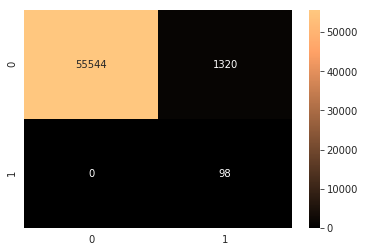

<table border="1" class="dataframe">
  <thead>
    <tr style="text-align: right;">
      <th></th>
      <th>Train_Recall</th>
      <th>Test_Recall</th>
      <th>Test_Specificity</th>
      <th>Optimize</th>
    </tr>
  </thead>
  <tbody>
    <tr>
      <th>SVC_default</th>
      <td>0.9998</td>
      <td>0.765306</td>
      <td>0.991119</td>
      <td>0.610469</td>
    </tr>
    <tr>
      <th>LogisticRegression_default</th>
      <td>0.9978</td>
      <td>0.989796</td>
      <td>0.976611</td>
      <td>0.787159</td>
    </tr>
    <tr>
      <th>DecisionTreeClassifier_default</th>
      <td>0.998</td>
      <td>0.989796</td>
      <td>0.993739</td>
      <td>0.790585</td>
    </tr>
    <tr>
      <th>KNeighborsClassifier_default</th>
      <td>0.9998</td>
      <td>0.908163</td>
      <td>0.96722</td>
      <td>0.719975</td>
    </tr>
    <tr>
      <th>LogisticRegression_search</th>
      <td>1</td>
      <td>1</td>
      <td>0.934018</td>
      <td>0.986804</td>
    </tr>
    <tr>
      <th>LogisticRegression_optimize</th>
      <td>1</td>
      <td>1</td>
      <td>0.976787</td>
      <td>0.995357</td>
    </tr>
  </tbody>
</table>
- Yes!! With our `optimize` function, specificity in `LogisticRegression` improved from `93%` to `97%`, while still having perfect recall.

### DecisionTreeClassifier- Optimized


     ---------------------------------------- 
     DecisionTreeClassifier 
     ----------------------------------------
    Best parameters: 
    
     {'class_weight': {1: 1, 0: 0.5}, 'criterion': 'gini', 'max_features': None} 

**Confusion matrix between `y_test` data and predictions from `X_test` .**

The rows show the actual data, the columns show the predicted data.


<table border="1" class="dataframe">
  <thead>
    <tr style="text-align: right;">
      <th></th>
      <th>Train_Recall</th>
      <th>Test_Recall</th>
      <th>Test_Specificity</th>
      <th>Optimize</th>
    </tr>
  </thead>
  <tbody>
    <tr>
      <th>SVC_default</th>
      <td>0.9998</td>
      <td>0.765306</td>
      <td>0.991119</td>
      <td>0.610469</td>
    </tr>
    <tr>
      <th>LogisticRegression_default</th>
      <td>0.9978</td>
      <td>0.989796</td>
      <td>0.976611</td>
      <td>0.787159</td>
    </tr>
    <tr>
      <th>DecisionTreeClassifier_default</th>
      <td>0.998</td>
      <td>0.989796</td>
      <td>0.993739</td>
      <td>0.790585</td>
    </tr>
    <tr>
      <th>KNeighborsClassifier_default</th>
      <td>0.9998</td>
      <td>0.908163</td>
      <td>0.96722</td>
      <td>0.719975</td>
    </tr>
    <tr>
      <th>LogisticRegression_search</th>
      <td>1</td>
      <td>1</td>
      <td>0.934018</td>
      <td>0.986804</td>
    </tr>
    <tr>
      <th>LogisticRegression_optimize</th>
      <td>1</td>
      <td>1</td>
      <td>0.976787</td>
      <td>0.995357</td>
    </tr>
    <tr>
      <th>DecisionTreeClassifier_optimize</th>
      <td>0.9968</td>
      <td>0.969388</td>
      <td>0.992139</td>
      <td>0.773938</td>
    </tr>
  </tbody>
</table>

- So `DecisionTreeClassifier` seems to be better at predicting non-frauds than others, but consistently misses a few frauds.
- Between default and optimize scores, `DecisionTree` lost accuracy. Well, some algorithms have their limitations.

### Support Vector Classifier- Optimized


     ---------------------------------------- 
     SVC 
     ----------------------------------------
    Best parameters: 
    
     {'C': 0.7, 'class_weight': {1: 1, 0: 0.7}, 'gamma': 'auto', 'kernel': 'rbf'} 

**Confusion matrix between `y_test` data and predictions from `X_test` .**

The rows show the actual data, the columns show the predicted data.


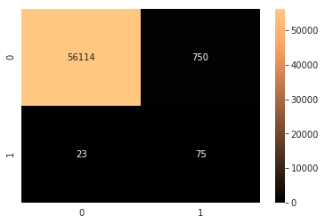

<table border="1" class="dataframe">
  <thead>
    <tr style="text-align: right;">
      <th></th>
      <th>Train_Recall</th>
      <th>Test_Recall</th>
      <th>Test_Specificity</th>
      <th>Optimize</th>
    </tr>
  </thead>
  <tbody>
    <tr>
      <th>SVC_default</th>
      <td>0.9998</td>
      <td>0.765306</td>
      <td>0.991119</td>
      <td>0.610469</td>
    </tr>
    <tr>
      <th>LogisticRegression_default</th>
      <td>0.9978</td>
      <td>0.989796</td>
      <td>0.976611</td>
      <td>0.787159</td>
    </tr>
    <tr>
      <th>DecisionTreeClassifier_default</th>
      <td>0.998</td>
      <td>0.989796</td>
      <td>0.993739</td>
      <td>0.790585</td>
    </tr>
    <tr>
      <th>KNeighborsClassifier_default</th>
      <td>0.9998</td>
      <td>0.908163</td>
      <td>0.96722</td>
      <td>0.719975</td>
    </tr>
    <tr>
      <th>LogisticRegression_search</th>
      <td>1</td>
      <td>1</td>
      <td>0.934018</td>
      <td>0.986804</td>
    </tr>
    <tr>
      <th>LogisticRegression_optimize</th>
      <td>1</td>
      <td>1</td>
      <td>0.976787</td>
      <td>0.995357</td>
    </tr>
    <tr>
      <th>DecisionTreeClassifier_optimize</th>
      <td>0.9968</td>
      <td>0.969388</td>
      <td>0.992139</td>
      <td>0.773938</td>
    </tr>
    <tr>
      <th>SVC_optimize</th>
      <td>1</td>
      <td>0.765306</td>
      <td>0.986811</td>
      <td>0.609607</td>
    </tr>
  </tbody>
</table>

- SVC's scores have the most disparity between train and test sets. Train splits had perfect recall, but test set was very poor.
- Compared with its default settings, its score also decreased. SVC can be very good at learning from train data, but it's very sensitive when tested in different data.

### KNeighborsClassifier- Optimized


     ---------------------------------------- 
     KNeighborsClassifier 
     ----------------------------------------
    Best parameters: 
    
     {'algorithm': 'ball_tree', 'leaf_size': 20, 'n_neighbors': 2, 'p': 1} 

**Confusion matrix between `y_test` data and predictions from `X_test` .**

The rows show the actual data, the columns show the predicted data.


<table border="1" class="dataframe">
  <thead>
    <tr style="text-align: right;">
      <th></th>
      <th>Train_Recall</th>
      <th>Test_Recall</th>
      <th>Test_Specificity</th>
      <th>Optimize</th>
    </tr>
  </thead>
  <tbody>
    <tr>
      <th>SVC_default</th>
      <td>0.9998</td>
      <td>0.765306</td>
      <td>0.991119</td>
      <td>0.610469</td>
    </tr>
    <tr>
      <th>LogisticRegression_default</th>
      <td>0.9978</td>
      <td>0.989796</td>
      <td>0.976611</td>
      <td>0.787159</td>
    </tr>
    <tr>
      <th>DecisionTreeClassifier_default</th>
      <td>0.998</td>
      <td>0.989796</td>
      <td>0.993739</td>
      <td>0.790585</td>
    </tr>
    <tr>
      <th>KNeighborsClassifier_default</th>
      <td>0.9998</td>
      <td>0.908163</td>
      <td>0.96722</td>
      <td>0.719975</td>
    </tr>
    <tr>
      <th>LogisticRegression_search</th>
      <td>1</td>
      <td>1</td>
      <td>0.934018</td>
      <td>0.986804</td>
    </tr>
    <tr>
      <th>LogisticRegression_optimize</th>
      <td>1</td>
      <td>1</td>
      <td>0.976787</td>
      <td>0.995357</td>
    </tr>
    <tr>
      <th>DecisionTreeClassifier_optimize</th>
      <td>0.9968</td>
      <td>0.969388</td>
      <td>0.992139</td>
      <td>0.773938</td>
    </tr>
    <tr>
      <th>SVC_optimize</th>
      <td>1</td>
      <td>0.765306</td>
      <td>0.986811</td>
      <td>0.609607</td>
    </tr>
    <tr>
      <th>KNeighborsClassifier_optimize</th>
      <td>1</td>
      <td>0.897959</td>
      <td>0.990328</td>
      <td>0.716433</td>
    </tr>
  </tbody>
</table>
### Imblearn' BalancedRandomForest- Optimized

- This algorithm incorporates a RandomForestClassifier with a RandomUndersampling algorithm to balance classes according to the `sampling_strategy` parameter.


     ---------------------------------------- 
     BalancedRandomForestClassifier 
     ----------------------------------------
    Best parameters: 
    
     {'class_weight': {1: 1, 0: 0.6}, 'sampling_strategy': 'all'} 

**Confusion matrix between `y_test` data and predictions from `X_test` .**

The rows show the actual data, the columns show the predicted data.


<table border="1" class="dataframe">
  <thead>
    <tr style="text-align: right;">
      <th></th>
      <th>Train_Recall</th>
      <th>Test_Recall</th>
      <th>Test_Specificity</th>
      <th>Optimize</th>
    </tr>
  </thead>
  <tbody>
    <tr>
      <th>SVC_default</th>
      <td>0.9998</td>
      <td>0.765306</td>
      <td>0.991119</td>
      <td>0.610469</td>
    </tr>
    <tr>
      <th>LogisticRegression_default</th>
      <td>0.9978</td>
      <td>0.989796</td>
      <td>0.976611</td>
      <td>0.787159</td>
    </tr>
    <tr>
      <th>DecisionTreeClassifier_default</th>
      <td>0.998</td>
      <td>0.989796</td>
      <td>0.993739</td>
      <td>0.790585</td>
    </tr>
    <tr>
      <th>KNeighborsClassifier_default</th>
      <td>0.9998</td>
      <td>0.908163</td>
      <td>0.96722</td>
      <td>0.719975</td>
    </tr>
    <tr>
      <th>LogisticRegression_search</th>
      <td>1</td>
      <td>1</td>
      <td>0.934018</td>
      <td>0.986804</td>
    </tr>
    <tr>
      <th>LogisticRegression_optimize</th>
      <td>1</td>
      <td>1</td>
      <td>0.976787</td>
      <td>0.995357</td>
    </tr>
    <tr>
      <th>DecisionTreeClassifier_optimize</th>
      <td>0.9968</td>
      <td>0.969388</td>
      <td>0.992139</td>
      <td>0.773938</td>
    </tr>
    <tr>
      <th>SVC_optimize</th>
      <td>1</td>
      <td>0.765306</td>
      <td>0.986811</td>
      <td>0.609607</td>
    </tr>
    <tr>
      <th>KNeighborsClassifier_optimize</th>
      <td>1</td>
      <td>0.897959</td>
      <td>0.990328</td>
      <td>0.716433</td>
    </tr>
    <tr>
      <th>BalancedRandomForestClassifier_optimize</th>
      <td>0.9992</td>
      <td>0.989796</td>
      <td>0.99395</td>
      <td>0.790627</td>
    </tr>
  </tbody>
</table>
- Our best overall scores on test group. Recal wasn't perfect, but it has the highest combination of scores.

### SKlearn' RandomForestClassifier- Optimized

- This is the good ol' `RandomForestClassifier` from Sklearn. It's a less specialized implementation. We'll see how it stacks against Imblearn's implementation.


     ---------------------------------------- 
     RandomForestClassifier 
     ----------------------------------------
    Best parameters: 
    
     {'class_weight': {1: 1, 0: 7}, 'criterion': 'entropy'} 

**Confusion matrix between `y_test` data and predictions from `X_test` .**

The rows show the actual data, the columns show the predicted data.


- For overall-accuracy, I added a column below, `Mean_RecSpe`, which is the mean score between `Test_Recall`, `Test_Specificity`.
- `Optimize` is our custom-made score, which rewards perfect recalls, and prioritizes high specificity.

Those are our main criteria. 

<table border="1" class="dataframe">
  <thead>
    <tr style="text-align: right;">
      <th></th>
      <th>Train_Recall</th>
      <th>Test_Recall</th>
      <th>Test_Specificity</th>
      <th>Optimize</th>
      <th>Mean_RecSpe</th>
    </tr>
  </thead>
  <tbody>
    <tr>
      <th>SVC_default</th>
      <td>0.9998</td>
      <td>0.765306</td>
      <td>0.991119</td>
      <td>0.610469</td>
      <td>0.878213</td>
    </tr>
    <tr>
      <th>LogisticRegression_default</th>
      <td>0.9978</td>
      <td>0.989796</td>
      <td>0.976611</td>
      <td>0.787159</td>
      <td>0.983203</td>
    </tr>
    <tr>
      <th>DecisionTreeClassifier_default</th>
      <td>0.998</td>
      <td>0.989796</td>
      <td>0.993739</td>
      <td>0.790585</td>
      <td>0.991768</td>
    </tr>
    <tr>
      <th>KNeighborsClassifier_default</th>
      <td>0.9998</td>
      <td>0.908163</td>
      <td>0.96722</td>
      <td>0.719975</td>
      <td>0.937692</td>
    </tr>
    <tr>
      <th>LogisticRegression_search</th>
      <td>1</td>
      <td>1</td>
      <td>0.934018</td>
      <td>0.986804</td>
      <td>0.967009</td>
    </tr>
    <tr>
      <th>LogisticRegression_optimize</th>
      <td>1</td>
      <td>1</td>
      <td>0.976787</td>
      <td>0.995357</td>
      <td>0.988393</td>
    </tr>
    <tr>
      <th>DecisionTreeClassifier_optimize</th>
      <td>0.9968</td>
      <td>0.969388</td>
      <td>0.992139</td>
      <td>0.773938</td>
      <td>0.980763</td>
    </tr>
    <tr>
      <th>SVC_optimize</th>
      <td>1</td>
      <td>0.765306</td>
      <td>0.986811</td>
      <td>0.609607</td>
      <td>0.876058</td>
    </tr>
    <tr>
      <th>KNeighborsClassifier_optimize</th>
      <td>1</td>
      <td>0.897959</td>
      <td>0.990328</td>
      <td>0.716433</td>
      <td>0.944143</td>
    </tr>
    <tr>
      <th>BalancedRandomForestClassifier_optimize</th>
      <td>0.9992</td>
      <td>0.989796</td>
      <td>0.99395</td>
      <td>0.790627</td>
      <td>0.991873</td>
    </tr>
    <tr>
      <th>RandomForestClassifier_optimize</th>
      <td>0.9994</td>
      <td>0.989796</td>
      <td>0.99534</td>
      <td>0.790905</td>
      <td>0.992568</td>
    </tr>
  </tbody>
</table>
- The traditional `RandomForestClassifier` was slightly better when put to test against the more specialized `BalancedRandomForestClassifier`.

# 4. Research Question

**What is the best way to predict frauds?** (Pick an approach...)

- Focus on reducing false negatives.
    VS
- Focus on reducing false positives.
    VS
- Focus on a custom balance?

# 5. Choosing Model

### Perfect Recall

- Judged by perfect recall and high specificity, `LogisticRegression` had the highest optimized score with `97%` specificity and `100%` recall.

### Best Overall

- For a more flexible approach, `RandomForestClassifier` had the highest combined recall and specificity with only one missed fraud and `99%` specificity.

# 6. Practical Use for Audiences of Interest

- **Bank’s fraud-prevention mechanisms. **
    (Annoying: Transactions canceled when traveling)
- **Data Science students.**
    Addition to the pool of Kaggle’s forks on this Dataset.

# 7. Weak Points & Shortcomings

- **Model Processing**- Involves many steps. Steps depend immensely on the data. This doesn’t lend itself to quick iterations. 
    - Could've used a processing pipeline function, but that's a more advanced method I haven't experimented with.
- **Need for Data Reduction**- 270,000 non-frauds were undersampled to 5,000… Definitely affected accuracy. A supercomputer might handle complete set without the need for reduction. 
    SVM and Kneighbors took the longest, even after undersampling the train data.
